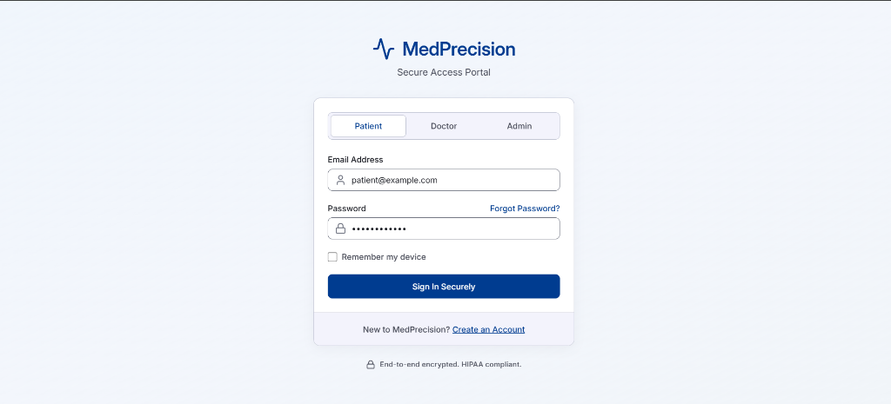
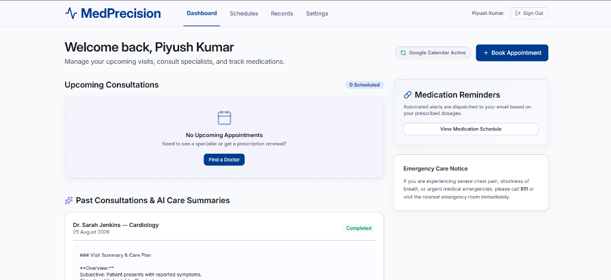
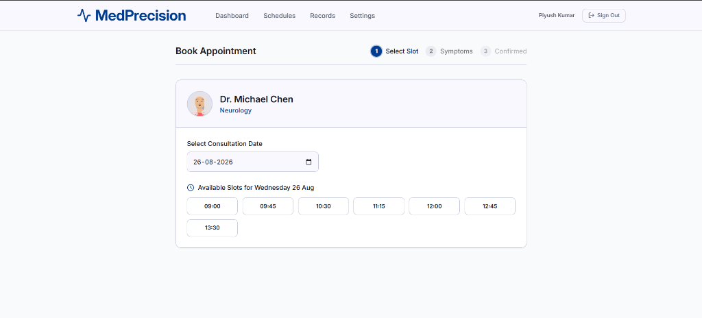
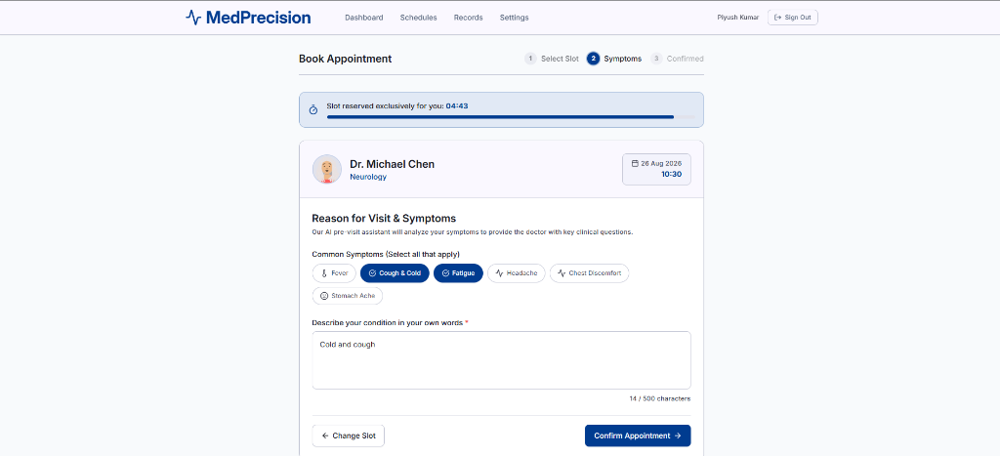
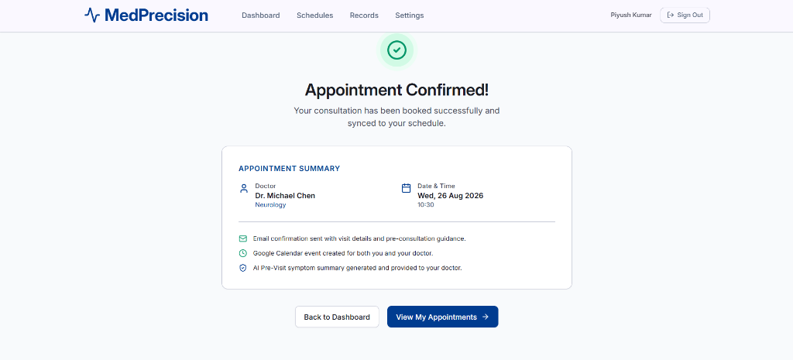

# 🩺 MedPrecision (MediFlow) — Healthcare Appointment & Follow-up Manager

[](https://nextjs.org/)
[](https://www.typescriptlang.org/)
[](https://tailwindcss.com/)
[](https://expressjs.com/)
[](https://supabase.com/)
[](https://prisma.io/)
[](https://developers.google.com/calendar)
[](https://resend.com/)
[](https://aistudio.google.com/)

> **MedPrecision** is a production-ready Healthcare Appointment & Follow-up Management Platform with Role-Based Portals (Patient, Doctor, Admin), AI Clinical Summarization, Hard Database-Level Double-Booking Prevention, Doctor Leave Conflict Management, Medication Reminders, and Multi-Channel Notification Sync (Resend Email & Google Calendar).

---

## 📸 Application Preview & UI Showcase

### 1. Multi-Role Secure Authentication Portal
*Unified, secure access portal for Patients, Doctors, and System Administrators with Supabase Auth and HIPAA-compliant session encryption.*

<p align="center">
  
</p>

---

### 2. Patient Dashboard & Care Plan Overview
*Live overview of upcoming appointments, medication dosage reminders, emergency care guidelines, and historical AI-generated visit summaries.*

<p align="center">
  
</p>

---

### 3. Dynamic Doctor Slot Picker
*Real-time calculation of available 30/45-minute consultation slots based on physician working hours, existing bookings, and recorded leaves.*

<p align="center">
  
</p>

---

### 4. 5-Minute Atomic Slot Hold & Symptom Intake Form
*Atomic 5-minute exclusive slot reservation with real-time countdown timer, preventing concurrent booking collisions while the patient inputs symptoms.*

<p align="center">
  
</p>

---

### 5. Multi-Channel Booking Confirmation
*Automated dispatch of transactional email confirmations, Google Calendar event creation, and AI pre-visit urgency analysis for the doctor.*

<p align="center">
  
</p>

---

## 📑 Table of Contents
1. [Application Preview & UI Showcase](#-application-preview--ui-showcase)
2. [System Architecture](#-system-architecture)
3. [Role-Based Portals & Key Features](#-role-based-portals--key-features)
4. [Tech Stack](#-tech-stack)
5. [Quick Start & Local Setup](#-quick-start--local-setup)
6. [Environment Variables Guide](#-environment-variables-guide)
7. [Database Schema & Hard Double-Booking Guards](#-database-schema--hard-double-booking-guards)
8. [REST API Documentation](#-rest-api-documentation)
9. [AI / LLM Integration & Prompts](#-ai--llm-integration--prompts)
10. [Google Calendar OAuth 2.0 Setup](#-google-calendar-oauth-20-setup)
11. [Email Notifications Setup (Resend)](#-email-notifications-setup-resend)
12. [Background Jobs & Medication Reminders](#-background-jobs--medication-reminders)
13. [System Design & Concurrency Highlights](#-system-design--concurrency-highlights)
14. [Automated Verification & Test Suite](#-automated-verification--test-suite)

---

## 🏥 System Architecture

```
┌─────────────────────────────────────────────────────────────┐
│                    Next.js Frontend (Port 3000)             │
│  Patient Portal ( /patient )   Doctor Portal ( /doctor )    │
│            Admin Center ( /admin )                          │
└──────────────────────────────┬──────────────────────────────┘
                               │ REST API + Supabase Bearer JWT
┌──────────────────────────────▼──────────────────────────────┐
│                    Express Backend API (Port 4000)          │
│  - SlotService (Dynamic slot chunking & 5-min holds)        │
│  - LLMService (Gemini / Claude + Clinical Heuristic)        │
│  - LeaveService (Atomic conflict rescheduling)              │
│  - CalendarService (Google Calendar OAuth 2.0 & Event Sync) │
│  - NotificationQueue (BullMQ / In-Process Worker)           │
└──────────────────────────────┬──────────────────────────────┘
                               │
┌──────────────────────────────▼──────────────────────────────┐
│                    Supabase PostgreSQL Database             │
│  - Partial Unique Constraint on Confirmed Bookings          │
│  - users, patients, doctors, appointments, symptom_forms    │
│  - visit_notes, medication_reminders, notification_logs     │
└─────────────────────────────────────────────────────────────┘
```

---

## ✨ Role-Based Portals & Key Features

### 1. Patient Portal (`/patient`)
- **Doctor Discovery (`/patient/find-doctor`)**: Search specialists by clinical domain, ratings, and hospital affiliation.
- **Interactive Booking (`/patient/book/[doctorId]`)**:
  - Dynamic slot generator based on working hours.
  - 5-minute atomic slot reservation hold with live countdown timer.
  - Pre-visit symptom form with chip tags and detailed description.
- **Appointment Management (`/patient/appointments`)**:
  - Review confirmed, completed, and rescheduled appointments.
  - **Interactive Rescheduling**: Pick new dates and available slots to reschedule appointments.
  - Safe cancellation with automatic slot release and calendar event deletion.
- **Care Plans & Records (`/patient/records`)**: Access AI patient-friendly care summaries and diagnosis history.
- **Medication Schedule (`/patient/schedules`)**: View live medication reminders generated from doctor prescriptions.
- **Google Calendar Sync (`/patient/settings`)**: Connect/Disconnect personal Google Calendar via OAuth 2.0.

### 2. Doctor Portal (`/doctor`)
- **Patient Queue**: Live overview of appointments with **AI Urgency Badges** (`HIGH`, `MEDIUM`, `LOW`).
- **Consultation Room (`/doctor/consultation/[id]`)**:
  - **AI Pre-Visit Summary**: Displays chief complaint and 3 suggested diagnostic questions for the doctor to ask.
  - **Clinical SOAP Notes**: Subjective, Objective, Assessment, Plan documentation.
  - **E-Prescription Builder**: Add drug name, dosage, frequency, and duration.
  - **Medication Reminder Generation**: Automatically persists structured dosage reminders for background delivery.
  - **AI Post-Visit Summary**: Converts clinical notes into patient-friendly summaries with multiple selectable modes (`PATIENT_FRIENDLY`, `CLINICAL_SOAP`, `BULLETED_CHECKLIST`, `REFERRAL_NOTE`).
- **Schedule (`/doctor/schedule`)**: View working hours and recorded PTO days.

### 3. Admin Center (`/admin`)
- **Analytics Overview**: Live metrics on active doctors, registered patients, total appointments, and dispatched alerts.
- **Doctor Roster Management**: Configure doctor profiles, specialization, working hours, and slot duration.
- **Doctor Leave Scheduler**:
  - Mark doctor on leave for any target date.
  - **Atomic conflict handler**: Automatically reschedules all affected confirmed appointments to `RESCHEDULED` in a single transaction and alerts patients via email.
- **Notification Health Monitor (`/admin/notifications`)**: Audit log tracking `SENT`, `FAILED`, and `DEAD_LETTER` notification dispatches.

---

## 💻 Tech Stack

- **Frontend**: Next.js 14 (App Router), React 18, TypeScript, Tailwind CSS, Lucide Icons.
- **Backend**: Node.js, Express, TypeScript, Prisma ORM, Zod, BullMQ / IORedis.
- **Database & Auth**: PostgreSQL (Supabase), Supabase Auth (Email/Password, Google OAuth).
- **AI / LLM**: Google Gemini API (`gemini-1.5-flash`) & Anthropic Claude with deterministic clinical heuristic fallback.
- **Email Notifications**: Resend (Transactional Healthcare Templates).
- **Calendar Synchronization**: Google Calendar API with OAuth 2.0.

---

## 🚀 Quick Start & Local Setup

### 1. Clone & Install Dependencies
```bash
git clone https://github.com/PiyushAI/Unthinkalble_HealthCare_Management_System.git
cd Unthinkalble_HealthCare_Management_System

# Backend dependencies
cd backend
npm install

# Frontend dependencies
cd ../frontend
npm install
```

### 2. Configure Environment Variables
Copy `.env.example` to `.env` in both folders:
- `backend/.env` (Database URL, Supabase keys, Gemini key, Resend key, Google OAuth credentials)
- `frontend/.env.local` (Supabase URL, Anon key, Backend API URL)

### 3. Run Database Migrations & Seed
```bash
cd backend
npx prisma generate
npx prisma db push
npm run prisma:seed
```

### 4. Start Development Servers
```bash
# Start Backend (Port 4000)
cd backend
npm run dev

# Start Frontend (Port 3000)
cd frontend
npm run dev
```

---

## 🔑 Environment Variables Guide

### Backend (`backend/.env`)
```env
PORT=4000
NODE_ENV=development
APP_URL="http://localhost:3000"

# Database
DATABASE_URL="postgresql://postgres:[PASSWORD]@[HOST]:5432/postgres"
DIRECT_URL="postgresql://postgres:[PASSWORD]@[HOST]:5432/postgres"

# Supabase Auth
SUPABASE_URL="https://[PROJECT].supabase.co"
SUPABASE_ANON_KEY="your-anon-key"
SUPABASE_SERVICE_ROLE_KEY="your-service-role-key"

# AI / LLM (Gemini / Anthropic)
GEMINI_API_KEY="AIzaSy..."
ANTHROPIC_API_KEY="sk-ant-..."

# Email Notifications (Resend)
RESEND_API_KEY="re_..."
EMAIL_FROM="MediFlow <appointments@yourdomain.com>"

# Google Calendar OAuth 2.0
GOOGLE_CLIENT_ID="xxxx.apps.googleusercontent.com"
GOOGLE_CLIENT_SECRET="xxxx"
GOOGLE_REDIRECT_URI="http://localhost:4000/auth/google/calendar/callback"
```

### Frontend (`frontend/.env.local`)
```env
NEXT_PUBLIC_API_URL="http://localhost:4000"
NEXT_PUBLIC_SUPABASE_URL="https://[PROJECT].supabase.co"
NEXT_PUBLIC_SUPABASE_ANON_KEY="your-anon-key"
```

---

## 🛡️ Database Schema & Hard Double-Booking Guards

### Hard Concurrency Guarantee
MedPrecision enforces double-booking prevention at the PostgreSQL storage engine layer using a partial unique index:
```sql
CREATE UNIQUE INDEX "appointments_doctor_slot_confirmed_unique"
ON "appointments"("doctorId", "slotStart")
WHERE status = 'CONFIRMED';
```
- **Invariant**: No two rows can ever have `status = 'CONFIRMED'` for the same doctor and slot start time.
- **Race Condition Handling**: If two concurrent booking requests pass application checks at the exact same millisecond, only ONE transaction commits; the second trips the partial unique constraint and receives HTTP `409 Conflict` (`SLOT_NO_LONGER_AVAILABLE`).

---

## 🔌 REST API Documentation

### Public & Patient Endpoints
- `GET /doctors`: List doctors, optionally filtered by `?specialization=`.
- `GET /doctors/:id`: Retrieve doctor profile and leaves.
- `GET /doctors/:id/slots?date=YYYY-MM-DD`: Compute available slots for a doctor on a given date.
- `POST /appointments/hold`: Create a 5-minute temporary slot hold (`doctorId`, `slotStart`).
- `POST /appointments/confirm`: Atomically finalize booking from hold and save symptoms.
- `GET /appointments/me` (or `GET /patient/appointments`): Retrieve authenticated patient's appointments.
- `GET /appointments/:id`: Retrieve single appointment details (with IDOR protection).
- `POST /appointments/:id/reschedule`: Reschedule appointment to a new slot with atomic validation.
- `POST /appointments/:id/cancel`: Cancel appointment, clean up reminders, and delete calendar events.
- `GET /patient/reminders`: Retrieve patient's active medication reminder schedule.

### Google Calendar OAuth Endpoints
- `GET /auth/google/calendar/connect`: Generates Google OAuth 2.0 authorization URL.
- `GET /auth/google/calendar/callback`: OAuth callback handler to save `googleRefreshToken`.
- `POST /auth/google/calendar/disconnect`: Disconnects Google Calendar integration.
- `GET /auth/google/calendar/status`: Returns `{ connected: boolean }`.

### Doctor Endpoints
- `GET /doctor/appointments`: List appointments for the logged-in doctor.
- `GET /doctor/patients`: List unique patients with visit history.
- `POST /doctor/generate-summary`: Preview AI summary for clinical notes.
- `POST /doctor/appointments/:id/visit-notes`: Submit clinical notes, prescription, and complete consultation.
- `GET /doctor/records`: Retrieve completed consultation records.
- `GET /doctor/schedule`: View doctor working hours and leave records.

### Admin Endpoints
- `GET /admin/doctors`: List all doctors with schedules and confirmed booking counts.
- `POST /admin/doctors`: Create a doctor profile (working hours, slot duration).
- `PATCH /admin/doctors/:id`: Update doctor details.
- `POST /admin/doctors/:id/leaves`: Record doctor leave and atomically reschedule conflicting appointments.
- `GET /admin/stats`: Hospital-wide analytics metrics.
- `GET /admin/notifications/failed`: Real-time notification health logs.

---

## 🤖 AI / LLM Integration & Prompts

### 1. Pre-Visit Summary Prompt
```
Analyse these symptoms and return ONLY a JSON object with keys "urgencyLevel" (one of "LOW","MEDIUM","HIGH"), "chiefComplaint" (string), and "suggestedQuestions" (array of exactly 3 short strings for the doctor to ask). No markdown code blocks, no other text.
Symptoms: <symptoms>
```

### 2. Post-Visit Summary Prompt
```
Convert these clinical notes into a warm, patient-friendly care summary with medication schedule and clear follow-up steps.
Clinical notes: <clinicalNotes>
Prescription: <prescriptionSummaryText>
```

### Fallback Guarantee
If external LLM APIs (Gemini / Anthropic) are unreachable, timed out, or unconfigured, the system's built-in **Deterministic Clinical Heuristic Engine** evaluates symptoms, assigns urgency levels, and formats care summaries instantaneously without disrupting the booking or consultation workflows.

---

## 📅 Google Calendar OAuth 2.0 Setup

1. Open [Google Cloud Console](https://console.cloud.google.com/).
2. Create or select a Project ➔ Go to **APIs & Services** ➔ **Library**.
3. Search for **Google Calendar API** and click **Enable**.
4. Navigate to **APIs & Services** ➔ **Credentials** ➔ **Create Credentials** ➔ **OAuth client ID**.
5. Select Application Type: **Web application**.
6. Under **Authorized redirect URIs**, add:
   ```
   http://localhost:4000/auth/google/calendar/callback
   ```
7. Copy the **Client ID** and **Client Secret** into `backend/.env`:
   ```env
   GOOGLE_CLIENT_ID="your-client-id.apps.googleusercontent.com"
   GOOGLE_CLIENT_SECRET="your-client-secret"
   GOOGLE_REDIRECT_URI="http://localhost:4000/auth/google/calendar/callback"
   ```
8. In the Patient Portal, go to **Settings** ➔ Click **Connect Google Calendar** to authorize.

---

## ✉️ Email Notifications Setup (Resend)

1. Sign up for a free account at [Resend](https://resend.com/).
2. Navigate to **API Keys** ➔ Click **Create API Key**.
3. Add key to `backend/.env`:
   ```env
   RESEND_API_KEY="re_123456789"
   EMAIL_FROM="MediFlow <onboarding@resend.dev>"
   ```
4. All booking confirmations, reschedule notices, cancellation emails, doctor leave alerts, and post-visit summaries will automatically dispatch in real-time.

---

## ⏱️ Background Jobs & Medication Reminders

- The in-process background worker (`backend/src/queues/worker.ts`) runs an automated scanner every 60 seconds.
- It scans for `PENDING` rows in `medication_reminders` where `scheduledAt <= now`.
- When due, it dispatches an automated medication dosage reminder email to the patient and marks the record as `SENT`.

---

## 📖 System Design & Concurrency Highlights

See [`SYSTEM_DESIGN.md`](SYSTEM_DESIGN.md) for the detailed 800-word design write-up covering:
1. Double-Booking Prevention with PostgreSQL Partial Unique Indexes.
2. 5-Minute Slot Hold Mechanism with TTL.
3. Doctor Leave Conflict Handling with Atomic Multi-Table Transactions.
4. Asynchronous Notification Retries, Fallbacks, and Dead-Letter Logging.

---

## 🧪 Automated Verification & Test Suite

Run the end-to-end integration and concurrency audit test suite:
```bash
cd backend
npx tsx scripts/audit-e2e-verification.ts
```

```
=======================================================
🧪 STARTING PRODUCTION AUDIT & VERIFICATION TEST SUITE
=======================================================

--- 1. Testing Database & Doctor Discovery ---
✅ [PASS] Doctor record retrieved from database
✅ [PASS] Patient record retrieved from database

--- 2. Testing Working Hours & Slot Generation ---
✅ [PASS] Available slots dynamically computed from working hours

--- 3. Testing 5-Min Slot Hold & Double-Booking Protection ---
✅ [PASS] Patient successfully placed 5-minute hold on slot
✅ [PASS] Simultaneous hold collision rejected via unique constraint
✅ [PASS] Booking confirmed from hold atomically

--- 4. Testing AI Pre-Visit Summary & Urgency Scoring ---
✅ [PASS] AI Symptom Urgency correctly classified (HIGH)
✅ [PASS] AI generated exactly 3 clinical questions for the doctor

--- 5. Testing Doctor Consultation, Prescriptions & Post-Visit Summary ---
✅ [PASS] AI Patient-Friendly Care Summary generated successfully
✅ [PASS] Structured Medication Reminders generated in DB from prescription

--- 6. Testing Google Calendar OAuth & Event Sync ---
✅ [PASS] Google OAuth 2.0 URL generated with minimum required calendar.events scope
✅ [PASS] Google Calendar event ID mapped and recorded
✅ [PASS] Google Calendar event update on reschedule executed idempotently

--- 7. Testing Doctor Leave & Conflict Auto-Rescheduling ---
✅ [PASS] Atomic leave handler detected conflicting appointment and rescheduled it
✅ [PASS] Conflicting appointment status transitioned to RESCHEDULED in DB
✅ [PASS] Doctor slots on leave date are completely blocked and unavailable

--- 8. Testing Multi-Channel Email Notifications ---
✅ [PASS] Email templates for Booking, Reschedule, Cancellation, Post-Visit Summary, and Dosage Reminders executed without errors

=======================================================
🎉 ALL AUDIT VERIFICATIONS PASSED: 17 / 17 TESTS
=======================================================
```
